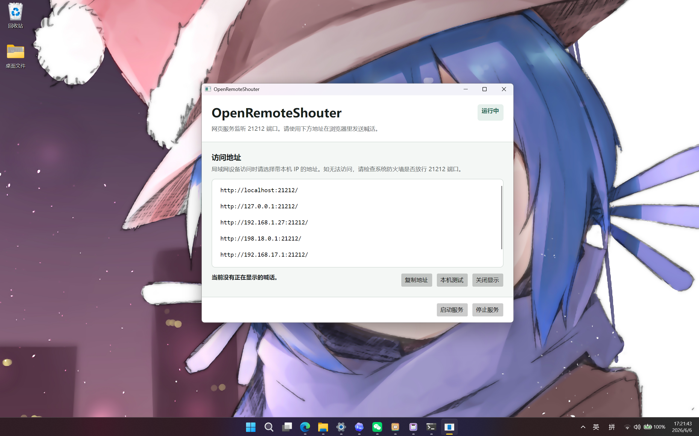
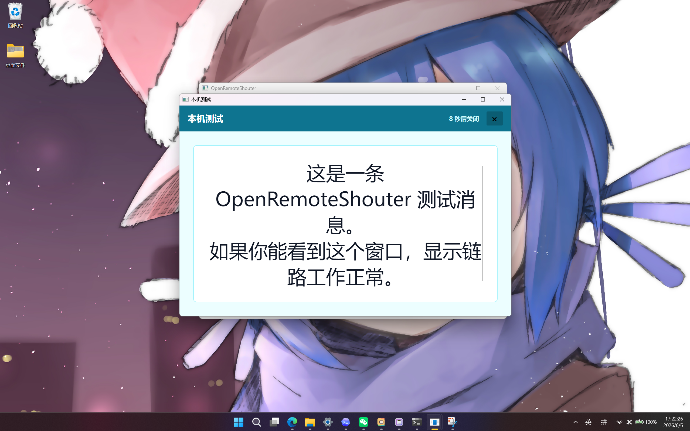
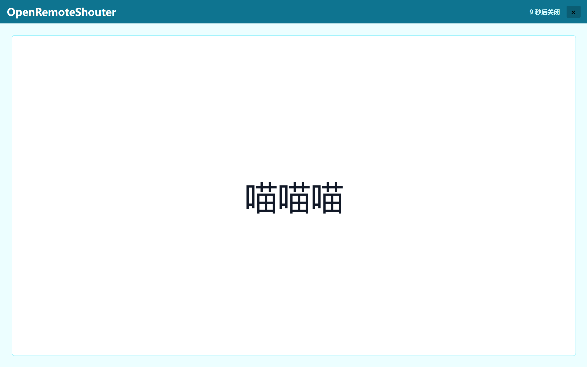
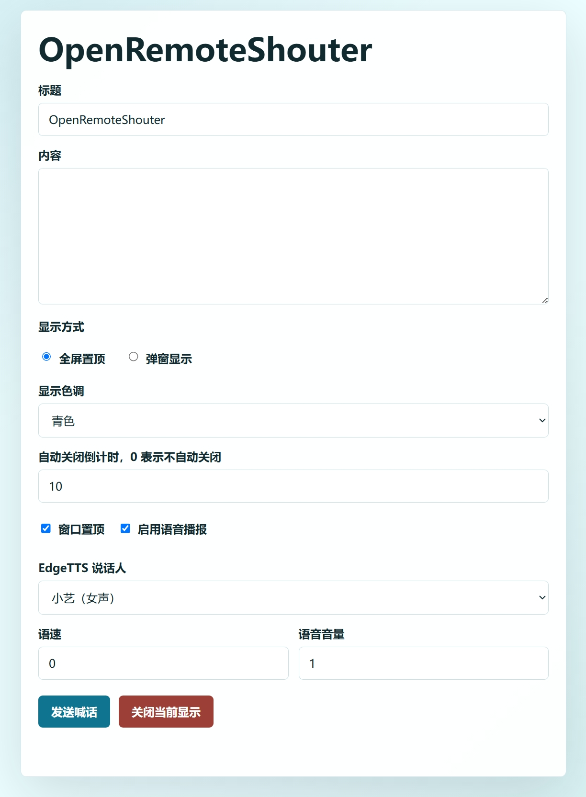

# OpenRemoteShouter

OpenRemoteShouter 是一个局域网远程喊话工具。它在电脑上启动一个本地网页服务，其他设备可以通过浏览器或 HTTP API 发送文字，让目标电脑弹出全屏/窗口提示并使用 EdgeTTS 语音播报。


<div align="center">

> ⚠️ 有人工智能参与编写

> ⚠️ 除 Windows 和 LoongArch64 Old World ABI 1.0 构建外，其他平台构建目前仅确认能够在 GitHub Actions 中完成打包，尚未经过实机运行测试。

</div>


## 功能

- **提供 LoongArch64 Old World ABI 1.0 专用构建包。**
- 局域网网页喊话，默认监听 `21212` 端口。
- 支持全屏置顶显示和普通弹窗显示。
- 支持自动关闭倒计时，`0` 表示手动关闭。
- 支持 EdgeTTS 中文语音播报。
- 支持网页表单、JSON API 和表单 POST。
- 支持 Windows、Linux、macOS 的多架构构建。

## 软件截图

#### 控制台



#### 窗口显示


#### 全屏显示


#### 网页喊话界面



## 使用

1. 下载适合当前系统的构建包。
2. 解压后运行：
   - Windows：运行 `run.bat` （不建议）或 `OpenRemoteShouter.exe`；`run.bat` 启动后会自动关闭。
   - Linux/macOS：运行 `./run.sh`，默认后台启动；如需在终端内查看输出，运行 `./run.sh --foreground`。
   - Portable 包：需要先安装 .NET 8 Runtime，再运行 `run.sh` 或 `run.bat`
3. 打开控制台窗口或托盘菜单，复制访问地址。
4. 在同一局域网设备的浏览器中访问该地址并发送喊话。

如果局域网设备无法访问，请检查防火墙是否放行 `21212` 端口。

## Linux 语音依赖

EdgeTTS 生成的是 WAV 音频。Linux 下程序会按顺序寻找以下播放器：

- `ffplay`
- `mpv`
- `pw-play`
- `paplay`
- `aplay`
- `cvlc`
- `vlc`

如果某个播放器在当前桌面环境中退出成功但实际没有声音，可以临时指定播放器：

```bash
OPEN_REMOTE_SHOUTER_AUDIO_PLAYER=paplay ./OpenRemoteShouter
```

常见安装命令：

```bash
# Debian/Ubuntu
sudo apt install pulseaudio-utils alsa-utils ffmpeg

# Fedora
sudo dnf install pulseaudio-utils alsa-utils ffmpeg

# Arch Linux
sudo pacman -S libpulse alsa-utils ffmpeg
```

如果没有可用播放器，控制台会显示语音后端错误，但文字喊话仍可使用。

## 日志与排查

程序会写入轻量级运行日志，用于排查 EdgeTTS 合成、音频缓存、播放器选择和播放器错误。

常见日志位置：

- 使用打包脚本启动：解压目录下的 `logs/openremoteshouter.log`
- Windows：`%LOCALAPPDATA%\OpenRemoteShouter\OpenRemoteShouter.log`
- Linux/macOS：`~/.local/share/OpenRemoteShouter/OpenRemoteShouter.log`

Linux/macOS 直接从终端运行主程序，或使用 `./run.sh --foreground` 时，日志会同步输出到终端。也可以用 `OPEN_REMOTE_SHOUTER_LOG_CONSOLE=1` 强制开启控制台日志。

`GET /api/status` 会返回实际使用的 `logFilePath` 字段。控制台窗口出现语音错误时，也会显示日志路径。

如果 Linux x64 或龙芯平台 TTS 没有声音，请优先查看日志中的 `Audio backend candidates`、`Trying audio player`、`Audio player failed` 和 `EdgeTTS synthesis completed`。

## HTTP API

服务启动后可访问：

- `GET /`：网页喊话表单
- `GET /api/status`：服务状态
- `GET /api/voices`：可用语音列表
- `POST /api/shout`：发送喊话
- `POST /api/close`：关闭当前显示

JSON 示例：

```bash
curl -X POST http://127.0.0.1:21212/api/shout \
  -H "Content-Type: application/json" \
  -d '{
    "title": "通知",
    "message": "这是一条远程喊话。",
    "mode": "fullscreen",
    "durationSeconds": 10,
    "topmost": true,
    "speechEnabled": true,
    "voiceName": "zh-CN-XiaoyiNeural",
    "speechRate": 0,
    "speechVolume": 1.0,
    "theme": "cyan"
  }'
```

字段说明：

| 字段 | 说明 |
| --- | --- |
| `title` | 显示标题，留空时使用默认标题 |
| `message` | 喊话内容，必填 |
| `mode` | `fullscreen` 或 `popup` |
| `durationSeconds` | 自动关闭秒数，范围 `0` 到 `3600` |
| `topmost` | 是否置顶 |
| `speechEnabled` | 是否语音播报 |
| `voiceName` | EdgeTTS 语音，如 `zh-CN-XiaoyiNeural` |
| `speechRate` | 语速，范围 `-100` 到 `100` |
| `speechVolume` | 音量，范围 `0.0` 到 `1.0` |
| `theme` | `cyan`、`blue`、`green`、`amber`、`rose`、`violet` |

## 构建产物

GitHub Actions 的 `Build OpenRemoteShouter` workflow 会构建并上传：

- `OpenRemoteShouter-portable-net8.0`
- `OpenRemoteShouter-win-x64`
- `OpenRemoteShouter-win-x86`
- `OpenRemoteShouter-win-arm64`
- `OpenRemoteShouter-linux-x64`
- `OpenRemoteShouter-linux-arm64`
- `OpenRemoteShouter-linux-arm`
- `OpenRemoteShouter-linux-musl-x64`
- `OpenRemoteShouter-linux-musl-arm64`
- `OpenRemoteShouter-osx-x64`
- `OpenRemoteShouter-osx-arm64`
- `OpenRemoteShouter-linux-loongarch64-oldworld-abi1.0`
- `OpenRemoteShouter-all-platforms`

`OpenRemoteShouter-all-platforms` 是发布用总包，里面包含所有平台包和校验文件。

`OpenRemoteShouter-linux-loongarch64-oldworld-abi1.0.tar.gz` 仅用于 LoongArch64 Old World ABI 1.0 系统。

## 本地构建

需要安装 .NET 8 SDK。

```bash
dotnet restore
dotnet build RemoteShouter.sln -c Release
dotnet publish RemoteShouter.csproj -c Release -r win-x64 --self-contained true
```

替换 `-r` 后的 Runtime Identifier 可以构建其他平台，例如 `linux-x64`、`linux-arm64`、`osx-arm64`。

## 注意事项

- EdgeTTS 需要联网访问微软语音服务。
- 全屏置顶效果受 Linux 桌面环境和窗口管理器影响。
- Linux 下语音播放依赖系统播放器。
- 除 Windows 和 LoongArch64 Old World ABI 1.0 外，其他平台构建尚未实机测试。
- macOS 首次运行可能需要在系统安全设置中允许该程序运行。
- Windows 可能需要让防火墙放行，检查网络类型设置为“专用网络”
