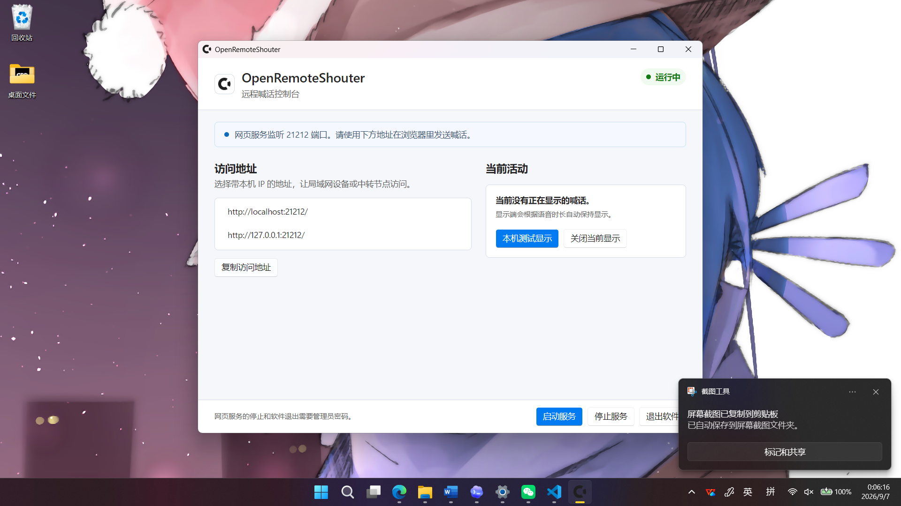
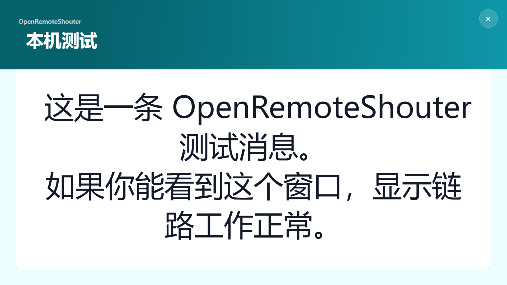
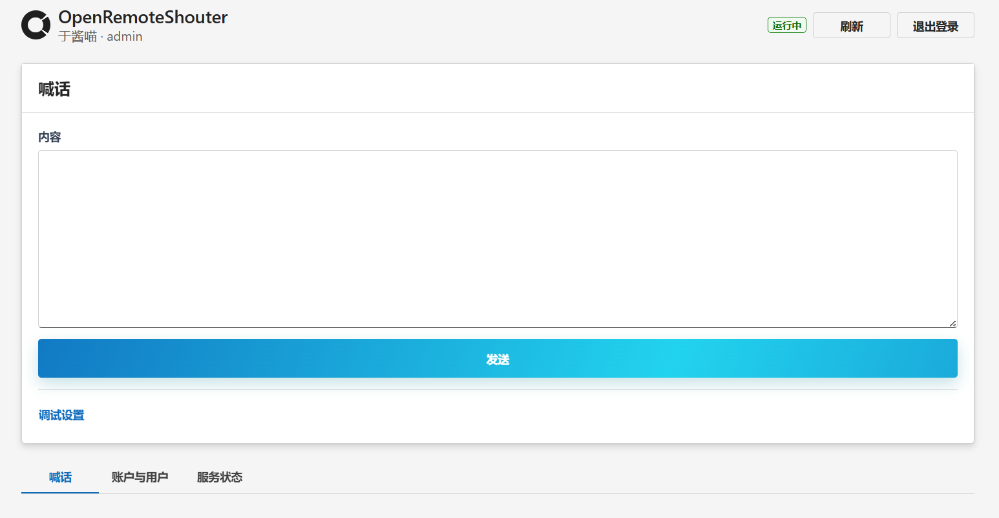
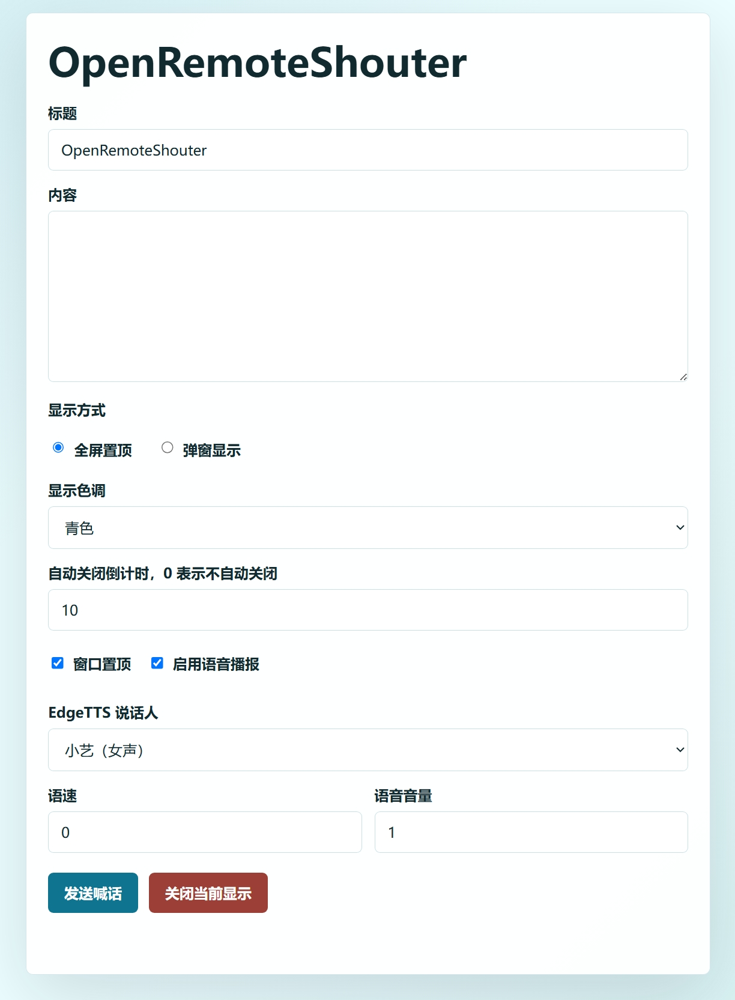

# OpenRemoteShouter

[English](README.en.md) | 简体中文

OpenRemoteShouter 是一个局域网远程喊话工具。它在电脑上启动一个本地网页服务，其他设备可以通过浏览器或 HTTP API 发送文字，让目标电脑弹出全屏/窗口提示并使用 EdgeTTS 语音播报。


<div align="center">

> ⚠️ 有人工智能参与编写

> ⚠️ 除 Windows 和 LoongArch64 Old World ABI 1.0 构建外，其他平台构建目前仅确认能够在 GitHub Actions 中完成打包，尚未经过实机运行测试。

</div>


## 功能

- **提供 LoongArch64 Old World ABI 1.0 专用构建包。**
- 局域网网页喊话，默认监听 `21212` 端口。
- 支持全屏置顶显示和普通弹窗显示。
- 支持自动关闭倒计时，`0` 表示手动关闭。
- 支持 EdgeTTS 中文语音播报。
- 支持网页表单、JSON API 和表单 POST。
- 支持 Windows、Linux、macOS 的多架构构建。

## 软件截图

#### 控制台



#### 窗口显示


#### 全屏显示


#### 网页喊话界面



## 使用

1. 下载适合当前系统的构建包。
2. 解压后运行：
   - Windows：运行 `run.bat` （不建议）或 `OpenRemoteShouter.exe`；`run.bat` 启动后会自动关闭。
   - Linux/macOS：运行 `./run.sh`，默认后台启动；如需在终端内查看输出，运行 `./run.sh --foreground`。
   - Portable 包：需要先安装 .NET 8 Runtime，再运行 `run.sh` 或 `run.bat`
3. 打开控制台窗口或托盘菜单，复制访问地址。
4. 默认服务只监听本机回环地址，先在本机浏览器完成初始化；如需让同一局域网设备访问，请配置 HTTPS PFX，或明确设置 `OPEN_REMOTE_SHOUTER_ALLOW_INSECURE_HTTP=1` 后再访问显示的 LAN 地址。

启用远程访问后仍无法访问，请检查防火墙是否放行 `21212` 端口以及证书/监听模式是否配置正确。

## 账户与安全

首次打开 WebUI 时，需要先在本机 `localhost` / `127.0.0.1` 创建管理员账户；远程设备不能抢先完成初始化。初始化后，WebUI 和喊话 API 都需要登录。

已实现的安全措施：

- 密码使用 PBKDF2-SHA256 加随机盐保存，不保存明文密码。
- 同一来源地址对同一用户名连续失败 5 次会锁定该组合 5 分钟；已存在的账户累计失败 20 次会进入 5 分钟账户级软限流，保护期内每 10 秒最多执行一次真实密码校验，错误尝试返回 429，正确密码可在下一个校验窗口登录并解除账户桶；来源地址还有 100 次失败/5 分钟的来源级上限。账户桶只对已存在账户建立，因此直接暴露到公网时 `401`/`429` 差异可能形成用户名存在性侧信道，建议在可信网关统一响应并做集中限流。限流记录只保存在当前进程内，重启或多实例部署不会共享，不能替代网关/WAF 的集中限流。
- 登录会话使用 HttpOnly、SameSite=Strict Cookie，并带过期时间。
- 所有修改类 API 都需要 CSRF 令牌。
- 修改密码、禁用用户或删除用户会使相关会话失效。
- 管理员不能禁用或删除自己的当前账户，系统至少保留一个启用的管理员。
- 首次管理员初始化只能从本机完成。
- WebUI 响应包含基础安全头和 CSP。
- 登录校验会限制单个来源的失败次数，并限制内存中的限流/会话记录数量。
- 账户数据库启动时会校验文件大小、结构、用户数量和密码哈希参数，损坏文件会拒绝加载而不会重新进入初始化。
- TTS 缓存和日志文件都有大小上限，超出时按最旧文件自动清理或轮转，避免磁盘被请求持续占满。

### 传输安全

未配置证书时，服务默认只监听本机回环地址上的 HTTP，适合首次初始化或本机使用。HTTP 不会加密密码、会话 Cookie 或 CSRF 令牌，不能把“局域网”视为可信网络。需要让其他设备访问时，优先配置 HTTPS PFX 证书：

```bash
export OPEN_REMOTE_SHOUTER_HTTPS_CERT_PATH=/path/to/server.pfx
read -r -s -p 'PFX password: ' OPEN_REMOTE_SHOUTER_HTTPS_CERT_PASSWORD
printf '\n'
export OPEN_REMOTE_SHOUTER_HTTPS_CERT_PASSWORD
./OpenRemoteShouter
unset OPEN_REMOTE_SHOUTER_HTTPS_CERT_PASSWORD
```

密码通过交互式静默输入，不会写入 shell 历史；在生产环境中更建议由服务管理器或密钥存储注入环境变量。

PFX 文件包含私钥，应限制为运行账户可读（Linux/macOS 可执行 `chmod 600 /path/to/server.pfx`，并确保其父目录不可被其他账户写入）。

来源地址限流按应用实际看到的 TCP 对端地址计算；程序不信任 `X-Forwarded-*` 头，因此反向代理或共享 NAT 后的多个用户可能共用一个来源桶。成功登录只清除该来源+用户名桶，不会清除来源级失败计数；需要多人共享出口时，应在可信网关上做更细粒度的限流，并避免把应用直接暴露在明文 HTTP 上。

在部署脚本中希望证书缺失时直接拒绝启动，可以再设置 `OPEN_REMOTE_SHOUTER_REQUIRE_HTTPS=1`。

配置证书后服务只在该端口提供 HTTPS，并会在访问地址中显示 `https://`；Cookie 会自动启用 `Secure` 属性。当前程序不信任 `X-Forwarded-*` 头，因此如果使用反向代理终止 TLS，应让应用本身加载 PFX，或确保代理到应用之间仍使用受保护的直连方案；否则应用会把请求视为 HTTP。首次初始化仍必须直接从运行程序的本机访问，不能通过未受信任的反向代理转发初始化请求。

如果必须兼容旧的局域网明文部署，需显式设置 `OPEN_REMOTE_SHOUTER_ALLOW_INSECURE_HTTP=1` 才会监听所有网卡；启动日志会持续提示风险。此模式下密码、会话 Cookie 和 CSRF 令牌均可能被网络窃听，生产环境不应使用。

账户数据默认保存到系统用户数据目录的 `accounts.json`。如需指定数据目录，可以设置：

```bash
OPEN_REMOTE_SHOUTER_DATA_DIR=/path/to/data ./OpenRemoteShouter
```

自定义数据目录和 `OPEN_REMOTE_SHOUTER_LOG_FILE` 指向的父目录必须由运行账户独占，不能放在其他账户可写的共享目录中；Windows 下程序不强制修改 ACL，文件权限依赖目录本身的安全设置。

## Linux 语音依赖

EdgeTTS 默认生成 MP3 音频。Linux 下程序会按顺序寻找以下播放器：

启用语音播报时，喊话文本会发送到 Microsoft Bing EdgeTTS 服务进行合成；包含敏感信息的内容请关闭语音或采用自托管 TTS。

- `ffplay`
- `mpv`
- `pw-play`
- `cvlc`
- `vlc`

如果需要兼容只支持 WAV 的旧环境，可以切换 EdgeTTS 输出格式：

```bash
OPEN_REMOTE_SHOUTER_EDGE_TTS_FORMAT=wav ./OpenRemoteShouter
```

切换为 WAV 后，程序也会继续尝试 `paplay` 和 `aplay`。LoongArch64 Old World ABI 1.0 打包脚本会默认使用 WAV。

如果某个播放器在当前桌面环境中退出成功但实际没有声音，可以临时指定播放器：

```bash
OPEN_REMOTE_SHOUTER_AUDIO_PLAYER=ffplay ./OpenRemoteShouter
```

常见安装命令：

```bash
# Debian/Ubuntu
sudo apt install pulseaudio-utils alsa-utils ffmpeg

# Fedora
sudo dnf install pulseaudio-utils alsa-utils ffmpeg

# Arch Linux
sudo pacman -S libpulse alsa-utils ffmpeg
```

如果没有可用播放器，控制台会显示语音后端错误，但文字喊话仍可使用。

## 日志与排查

程序会写入轻量级运行日志，用于排查 EdgeTTS 合成、音频缓存、播放器选择和播放器错误。

常见日志位置：

- 使用打包脚本启动：解压目录下的 `logs/openremoteshouter.log`
- Windows：`%LOCALAPPDATA%\OpenRemoteShouter\OpenRemoteShouter.log`
- Linux/macOS：`~/.local/share/OpenRemoteShouter/OpenRemoteShouter.log`

Linux/macOS 直接从终端运行主程序，或使用 `./run.sh --foreground` 时，日志会同步输出到终端。也可以用 `OPEN_REMOTE_SHOUTER_LOG_CONSOLE=1` 强制开启控制台日志。

日志文件默认限制为 10 MiB，并保留最多 3 个轮转文件（例如 `.1`、`.2`、`.3`）。可以按部署环境调整，单位分别是字节和轮转文件数量：

```bash
export OPEN_REMOTE_SHOUTER_LOG_MAX_BYTES=10485760
export OPEN_REMOTE_SHOUTER_LOG_MAX_FILES=3
```

程序还会限制 TTS 缓存默认最多 256 MiB、512 个音频文件；缓存只保留当前目录中的程序生成音频，超过限制时优先删除最旧文件。可用以下环境变量调整：

```bash
export OPEN_REMOTE_SHOUTER_TTS_CACHE_MAX_BYTES=268435456
export OPEN_REMOTE_SHOUTER_TTS_CACHE_MAX_FILES=512
```

单次 TTS WebSocket 消息和音频响应也有 16 MiB 上限，异常或失控的上游响应不会无限占用内存。

无效或过小的值会回退到安全默认值。缓存和日志的限额只影响持久化文件，不会改变文字喊话功能。

管理员调用 `GET /api/status` 会看到实际使用的 `logFilePath` 字段；普通用户会看到脱敏提示。控制台窗口出现语音错误时，也会显示日志路径。

如果 Linux x64 或龙芯平台 TTS 没有声音，请优先查看日志中的 `Audio backend candidates`、`Trying audio player`、`Audio player failed` 和 `EdgeTTS synthesis completed`。

## LoongArch64 Old World ABI 1.0 兼容

龙芯旧世界构建参考 ClassIsland 的 X11 兼容策略：

- 默认启用 Avalonia 软件渲染。
- 默认设置 `LIBGL_ALWAYS_SOFTWARE=1`、`GALLIUM_DRIVER=llvmpipe` 和 `AVALONIA_RENDERING_FORCE_SOFTWARE=1`。
- 默认禁用 DBus 菜单和 DBus 文件选择器。
- `OPEN_REMOTE_SHOUTER_X11_ENABLE_IME=auto` 会自动检测 Fcitx DBus；没有可用 Fcitx 时禁用 IME，避免 X11 输入法链路异常影响 UI。
- 默认继续使用 WAV EdgeTTS 输出，减少旧环境音频解码依赖变化。

可手动覆盖：

```bash
OPEN_REMOTE_SHOUTER_SOFTWARE_RENDERING=0 ./run.sh --foreground
OPEN_REMOTE_SHOUTER_X11_ENABLE_IME=1 ./run.sh --foreground
```

## HTTP API

服务启动后可访问：

- `GET /`：网页喊话表单
- `GET /api/auth/state`：当前登录/初始化状态
- `POST /api/auth/login`：登录并建立会话
- `POST /api/auth/logout`：退出当前会话
- `POST /api/auth/password`：修改当前账户密码
- `GET /api/status`：服务状态
- `GET /api/voices`：可用语音列表
- `POST /api/shout`：发送喊话
- `POST /api/close`：关闭当前显示
- `GET/POST/PUT/DELETE /api/users`：管理员用户管理

除登录和首次本机初始化外，修改类 API 需要同时发送登录 Cookie 和 `X-OpenRemoteShouter-CSRF` 令牌。登录响应中的 `state.csrfToken` 就是当前会话令牌。下面是一个不会把密码直接写进命令行参数的 `curl` 示例（需要 `jq`）：

```bash
set -eu
umask 077
base_url=http://127.0.0.1:21212
cookie_file="$(mktemp)"
trap 'rm -f "$cookie_file"; unset ORS_PASSWORD' EXIT

read -r -s -p 'Password: ' ORS_PASSWORD
printf '\n'
login_json="$(jq -n --arg username 'admin' --arg password "$ORS_PASSWORD" \
  '{username: $username, password: $password}')"
login_response="$(curl --fail-with-body -sS -c "$cookie_file" \
  -H 'Content-Type: application/json' \
  -X POST "$base_url/api/auth/login" -d "$login_json")"
csrf_token="$(printf '%s' "$login_response" | jq -r '.state.csrfToken')"

curl --fail-with-body -sS -b "$cookie_file" \
  -H 'Content-Type: application/json' \
  -H "X-OpenRemoteShouter-CSRF: $csrf_token" \
  -X POST "$base_url/api/shout" \
  -d '{
    "title": "通知",
    "message": "这是一条远程喊话。",
    "mode": "fullscreen",
    "durationSeconds": 10,
    "topmost": true,
    "speechEnabled": true,
    "voiceName": "zh-CN-XiaoyiNeural",
    "speechRate": 0,
    "speechVolume": 1.0,
    "theme": "cyan"
  }'
```

如果服务启用了 HTTPS，将 `base_url` 改为 `https://主机名:21212`，并按证书部署策略配置 `curl` 的证书校验。首次初始化只能从运行程序的本机直接访问 `/api/auth/setup`，不能用上面的远程登录流程代替。

字段说明：

| 字段 | 说明 |
| --- | --- |
| `title` | 显示标题，留空时使用默认标题 |
| `message` | 喊话内容，必填 |
| `mode` | `fullscreen` 或 `popup` |
| `durationSeconds` | 自动关闭秒数，范围 `0` 到 `3600` |
| `topmost` | 是否置顶 |
| `speechEnabled` | 是否语音播报 |
| `voiceName` | EdgeTTS 语音，如 `zh-CN-XiaoyiNeural` |
| `speechRate` | 语速，范围 `-100` 到 `100` |
| `speechVolume` | 音量，范围 `0.0` 到 `1.0` |
| `theme` | `cyan`、`blue`、`green`、`amber`、`rose`、`violet` |

## 构建产物

GitHub Actions 的 `Build OpenRemoteShouter` workflow 会构建并上传：

- `OpenRemoteShouter-portable-net8.0`
- `OpenRemoteShouter-win-x64`
- `OpenRemoteShouter-win-x86`
- `OpenRemoteShouter-win-arm64`
- `OpenRemoteShouter-linux-x64`
- `OpenRemoteShouter-linux-arm64`
- `OpenRemoteShouter-linux-arm`
- `OpenRemoteShouter-linux-musl-x64`
- `OpenRemoteShouter-linux-musl-arm64`
- `OpenRemoteShouter-osx-x64`
- `OpenRemoteShouter-osx-arm64`
- `OpenRemoteShouter-linux-loongarch64-oldworld-abi1.0`
- `OpenRemoteShouter-all-platforms`（CI 内部汇总包）

GitHub Release 会将每个平台包作为独立附件列出，文件名对应目标平台；同时提供 `SHA256SUMS.txt`，Release 正文中也会列出相同的 SHA256 校验值。CI 仍会保留 `OpenRemoteShouter-all-platforms` 汇总包用于流水线内部校验，但它不会作为公开 Release 附件发布。

`OpenRemoteShouter-linux-loongarch64-oldworld-abi1.0.tar.gz` 仅用于 LoongArch64 Old World ABI 1.0 系统。

## 本地构建

需要安装 .NET 8 SDK。

```bash
dotnet restore
dotnet build RemoteShouter.sln -c Release
dotnet publish RemoteShouter.csproj -c Release -r win-x64 --self-contained true
```

替换 `-r` 后的 Runtime Identifier 可以构建其他平台，例如 `linux-x64`、`linux-arm64`、`osx-arm64`。

## 注意事项

- EdgeTTS 需要联网访问微软语音服务。
- 全屏置顶效果受 Linux 桌面环境和窗口管理器影响。
- Linux 下语音播放依赖系统播放器。
- 除 Windows 和 LoongArch64 Old World ABI 1.0 外，其他平台构建尚未实机测试。
- macOS 首次运行可能需要在系统安全设置中允许该程序运行。
- Windows 可能需要让防火墙放行，检查网络类型设置为“专用网络”
