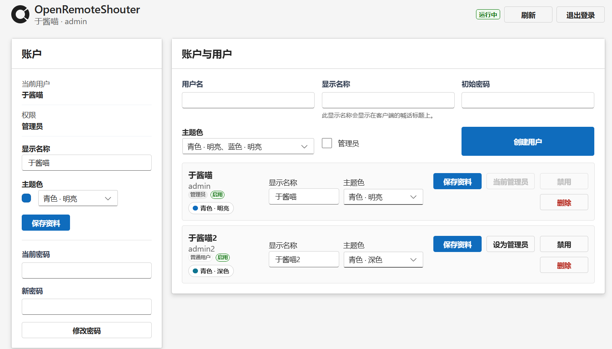
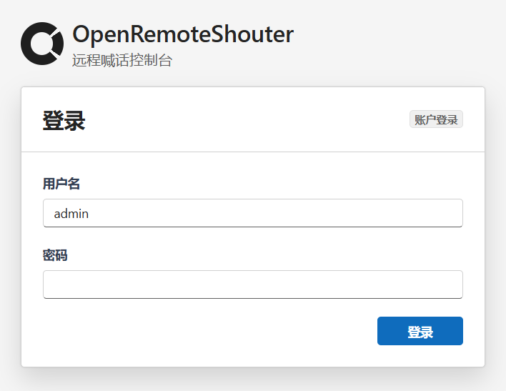

# OpenRemoteShouter

[English](README.en.md) | 简体中文

OpenRemoteShouter 是一个局域网远程喊话工具。它在电脑上启动一个本地网页服务，其他设备可以通过浏览器或 HTTP API 发送文字，让目标电脑以 Fluent 风格的全屏动态提示显示并使用 EdgeTTS 语音播报。


<div align="center">

> ⚠️ 有人工智能参与编写

> ⚠️ 除 Windows 和 LoongArch64 Old World ABI 1.0 构建外，其他平台构建目前仅确认能够在 GitHub Actions 中完成打包，尚未经过实机运行测试。

</div>

## 功能

- **提供 LoongArch64 Old World ABI 1.0 专用构建包。**
- 提供桌面控制台、系统托盘和 WebUI，网页服务使用 `21212` 端口。
- 默认仅允许本机访问；设置 `OPEN_REMOTE_SHOUTER_ALLOW_LAN=1` 后才允许通过局域网 IP 访问。
- 支持主题色驱动的全屏动态渐变提示，标题和正文以非线性动画进入。
- 显示时间按 TTS 实际返回的音频文件时长自动分配，最少显示 10 秒。
- 支持 EdgeTTS 中文语音播报、说话人选择、语速和音量设置。
- 支持发送后撤回当前显示或继续发送下一条消息。
- 支持账户登录、显示名称、20 种明暗主题、管理员用户管理和旧账户主题色迁移。
- 支持 WebUI 和 JSON HTTP API，状态修改接口带会话与 CSRF 校验。
- 支持 Windows、Linux、macOS 的多架构构建。
- 桌面端使用 FluentAvalonia，WebUI 内置 Fluent UI Web Components，不依赖 CDN。

## 软件截图

#### 控制台


#### 动态全屏显示


#### 网页喊话界面





## 快速开始

### 本机初始化

1. 下载并解压适合当前系统的 Release 构建包。
2. 启动程序：
   - Windows：运行 `run.bat`，也可以直接运行包内的 `OpenRemoteShouter.exe`。
   - Linux/macOS：运行 `./run.sh`；发布包脚本默认后台启动，使用 `./run.sh --foreground` 可在终端查看输出。
   - Portable 包：先安装 .NET 8 Runtime，再运行包内的 `run.bat` 或 `run.sh`。
3. 左键单击托盘图标打开控制台，右键单击打开系统托盘菜单；也可以从菜单复制访问地址或执行本机测试。
4. 在本机打开 `http://localhost:21212/`。首次使用时创建管理员账户，之后使用该账户登录。

默认情况下服务只监听 `localhost` / `127.0.0.1`，其他电脑或手机无法直接访问。首次管理员创建也默认只能在本机完成。

### 开启局域网访问

要让同一局域网中的手机或电脑通过本机 IP 访问，必须在**启动程序前**设置：

```text
OPEN_REMOTE_SHOUTER_ALLOW_LAN=1
```

发布包的 `run.bat` 和 `run.sh` 已包含被注释的配置行，取消对应行的注释后重新启动程序即可。也可以临时启动：

```powershell
# Windows PowerShell
$env:OPEN_REMOTE_SHOUTER_ALLOW_LAN = "1"
.\run.bat
```

```bash
# Linux/macOS
OPEN_REMOTE_SHOUTER_ALLOW_LAN=1 ./run.sh --foreground
```

启用后，桌面控制台的访问地址列表会出现 `http://<局域网IP>:21212/` 或对应的 HTTPS 地址。请先在本机完成管理员初始化，再从其他设备登录。如果仍无法连接，请确认程序已经重启、防火墙已放行 TCP `21212`，且访问的是控制台列出的地址。

> 未配置证书时，开启局域网访问会把密码、会话和喊话内容放在明文 HTTP 中传输。可信网络之外应配置 HTTPS，或使用后文的可信中转方案。

### WebUI 与桌面端操作

登录 WebUI 后默认进入喊话页。置顶、语音、说话人、语速、音量、关闭当前显示以及设置导入/导出位于“调试设置”中；浏览器设置按登录用户名保存在本地 Cookie 中。发送成功后可以撤回当前显示或继续发送下一条消息。

桌面控制台可以查看服务状态和访问地址、复制地址、进行本机显示测试、关闭当前显示以及启动或停止网页服务。托盘左键打开控制台，右键打开菜单。停止网页服务和退出软件前，必须输入任意一个启用中的管理员密码；任务管理器等操作系统级强制结束不在软件拦截范围内。

## 账户与权限

首次打开 WebUI 时，需要从本机创建管理员账户。初始化后，WebUI 和喊话 API 都需要登录；只有显式配置可信中转、HTTPS 和高熵令牌后，才允许经中转进行远程首次初始化。

- 所有启用中的用户都可以修改自己的显示名称、主题色和密码。
- 显示名称会出现在客户端喊话标题中，喊话主题色由当前登录账户决定，调用 API 时不能冒充其他显示名称或主题色。
- 20 个明暗主题色为单选，并且不同账户不能使用同一个主题色；冲突时 WebUI 会显示提示并刷新可用选项。
- 管理员可以创建、编辑、启用、禁用和删除其他用户；普通用户不会看到用户管理区域。
- 当前管理员不能取消自己的管理员权限、禁用或删除自己的账户，系统始终至少保留一个启用中的管理员。
- 从旧版本升级时，缺失或重复的主题色会按 `accounts.json` 中的稳定顺序分配到未使用的主题色并自动写回；账户超过 20 个时，剩余重复项需要管理员手动处理。

如果全新解压后页面显示“账户服务不可用”或意外显示登录页，请检查实际运行账户的数据目录、`accounts.json` 的权限与完整性以及日志。Windows 默认账户文件为 `%LOCALAPPDATA%\OpenRemoteShouter\accounts.json`。升级或重新解压不会清空旧账户；损坏或空的账户数据库会被拒绝加载，不会自动重新进入初始化。

### 安全设计

已实现的主要安全措施：

- 密码使用 PBKDF2-SHA256 加随机盐保存，不保存明文密码。
- 同一来源地址对同一用户名连续失败 5 次会锁定该组合 5 分钟；已存在的账户累计失败 20 次会进入 5 分钟账户级软限流，保护期内每 10 秒最多执行一次真实密码校验，错误尝试返回 429，正确密码可在下一个校验窗口登录并解除账户桶；来源地址还有 100 次失败/5 分钟的来源级上限。账户桶只对已存在账户建立，因此直接暴露到公网时 `401`/`429` 差异可能形成用户名存在性侧信道，建议在可信网关统一响应并做集中限流。限流记录只保存在当前进程内，重启或多实例部署不会共享，不能替代网关/WAF 的集中限流。
- 登录会话使用 HttpOnly、SameSite=Strict Cookie，并带过期时间。
- 所有修改类 API 都需要 CSRF 令牌。
- 修改密码、禁用用户或删除用户会使相关会话失效。
- 当前管理员不能降低、禁用或删除自己的当前账户，系统至少保留一个启用的管理员。
- 首次管理员初始化默认只能从本机完成；远程初始化必须同时满足固定中转 IP、显式开关、HTTPS 和高熵令牌。
- WebUI 响应包含基础安全头和 CSP。
- 登录校验会限制单个来源的失败次数，并限制内存中的限流/会话记录数量。
- 账户数据库启动时会校验文件大小、结构、用户数量和密码哈希参数，损坏文件会拒绝加载而不会重新进入初始化。
- TTS 缓存和日志文件都有大小上限，超出时按最旧文件自动清理或轮转，避免磁盘被请求持续占满。

## 网络与部署

| 模式 | 监听范围 | 适用场景 | 关键配置 |
| --- | --- | --- | --- |
| 本机模式（默认） | `localhost` / `127.0.0.1` | 本机初始化、测试或同机反向代理 | 不设置或设置 `OPEN_REMOTE_SHOUTER_ALLOW_LAN=0` |
| 直接局域网访问 | 所有网卡 | 同一可信局域网中的手机/电脑直接连接 | `OPEN_REMOTE_SHOUTER_ALLOW_LAN=1`，建议同时配置 HTTPS |
| 可信中转 | 通常保持本机监听 | FRP、Nginx/Caddy、VPN 或其他受控入口 | 配置固定中转 IP；远程首次初始化还需显式开关、HTTPS 和一次性令牌 |

`OPEN_REMOTE_SHOUTER_ALLOW_LAN` 的显式值优先于旧变量。旧参数 `OPEN_REMOTE_SHOUTER_ALLOW_DIRECT_IP` 和 `OPEN_REMOTE_SHOUTER_ALLOW_INSECURE_HTTP` 仍用于兼容已有部署，但新配置应统一使用 `OPEN_REMOTE_SHOUTER_ALLOW_LAN`。

### HTTPS 与传输安全

未配置证书时，服务默认只监听本机回环地址上的 HTTP，适合首次初始化或本机使用。HTTP 不会加密密码、会话 Cookie 或 CSRF 令牌，不能把“局域网”视为可信网络。需要让其他设备访问时，优先配置 HTTPS PFX 证书：

```bash
export OPEN_REMOTE_SHOUTER_HTTPS_CERT_PATH=/path/to/server.pfx
read -r -s -p 'PFX password: ' OPEN_REMOTE_SHOUTER_HTTPS_CERT_PASSWORD
printf '\n'
export OPEN_REMOTE_SHOUTER_HTTPS_CERT_PASSWORD
./OpenRemoteShouter
unset OPEN_REMOTE_SHOUTER_HTTPS_CERT_PASSWORD
```

密码通过交互式静默输入，不会写入 shell 历史；在生产环境中更建议由服务管理器或密钥存储注入环境变量。

PFX 文件包含私钥，应限制为运行账户可读（Linux/macOS 可执行 `chmod 600 /path/to/server.pfx`，并确保其父目录不可被其他账户写入）。

### 可信中转

默认情况下，程序不信任任何转发头。若要让固定中转节点代为终止 HTTPS，请显式设置 `OPEN_REMOTE_SHOUTER_TRUSTED_PROXY_IPS`，只填写应用实际看到的 TCP 对端 IP，例如同机反代的 `127.0.0.1` 或 VPN 中转地址；只对白名单中的精确 IP 启用 `X-Forwarded-For`、`X-Forwarded-Host` 和 `X-Forwarded-Proto`。

若还要允许第一次管理员创建也走远程中转，再额外设置 `OPEN_REMOTE_SHOUTER_ALLOW_TRUSTED_PROXY_SETUP=1` 和至少 32 字节的随机 `OPEN_REMOTE_SHOUTER_TRUSTED_PROXY_SETUP_TOKEN`。只要请求的原始 TCP 对端命中中转白名单，服务端就一律按中转请求处理，不会因为中转改写了 `Host` 或删掉转发头而降级成免令牌本机路径；远程初始化开关未打开时会拒绝该请求，打开后则必须同时满足有效令牌和 HTTPS。令牌只通过 `X-OpenRemoteShouter-Setup-Token` 请求头提交，服务端只在空账户库时接受，并在本次进程成功初始化后失效。开关开启但缺少白名单或令牌时，程序会拒绝启动。

```bash
export OPEN_REMOTE_SHOUTER_TRUSTED_PROXY_IPS=127.0.0.1
export OPEN_REMOTE_SHOUTER_ALLOW_TRUSTED_PROXY_SETUP=1
export OPEN_REMOTE_SHOUTER_TRUSTED_PROXY_SETUP_TOKEN="$(openssl rand -base64 48)"
```

中转必须覆盖（而不是追加）客户端提交的 `X-Forwarded-Host`、`X-Forwarded-Proto` 和 `X-Forwarded-For`，并通过 FRP TLS、WireGuard、SSH 隧道或其他受保护链路连接班级端。不要把令牌放在 URL；不要把跨机器回源配置成裸 HTTP。远程初始化页面会显示令牌输入框；如果把同机 `127.0.0.1` 也列入中转白名单，应用无法再区分同一地址上的反代和本机浏览器，因此二者都按中转请求处理。若必须无令牌本机初始化，请在配置该回环白名单前先完成初始化，或暂时移除该地址并关闭远程初始化开关后重启服务。

命令行远程初始化时，把令牌放在请求头（不要放进 URL 或日志）：

```bash
read -r -s -p 'Setup token: ' ORS_SETUP_TOKEN
printf '\n'
curl --fail-with-body -sS \
  -H 'Content-Type: application/json' \
  -H 'Origin: https://class.example.test' \
  -H "X-OpenRemoteShouter-Setup-Token: $ORS_SETUP_TOKEN" \
  -X POST 'https://class.example.test/api/auth/setup' \
  -d '{"username":"teacher","displayName":"Teacher","password":"CHANGE-ME"}'
unset ORS_SETUP_TOKEN
```

Nginx/Caddy 等反代至少要把外部主机名和协议写入这些头（示意：`Host $host`、`X-Forwarded-Host $host`、`X-Forwarded-Proto $scheme`、`X-Forwarded-For $remote_addr`），并确保客户端不能预先注入同名值。若使用 FRP，应用看到的 TCP 对端通常是同机 `frpc` 的 `127.0.0.1`，此时白名单应填写 `127.0.0.1`，而不是想当然填写 `frps` 的公网地址；请以日志/网络实际观察到的对端地址为准。

#### FRP 中转示例

推荐让公网入口上的 `frps` 只转发到班级电脑上的 `frpc`，再由公网入口上的 Nginx/Caddy 负责 HTTPS。班级端应用监听 `127.0.0.1:21212`，`frpc` 映射到服务端 `127.0.0.1:22122`，反代再把 `https://class.example.test` 转到 `http://127.0.0.1:22122`。

服务端 `frps.toml`：

```toml
bindPort = 7000
auth.method = "token"
auth.token = "CHANGE_TO_A_LONG_RANDOM_FRP_TOKEN"
```

班级端 `frpc.toml`：

```toml
serverAddr = "relay.example.test"
serverPort = 7000
auth.method = "token"
auth.token = "CHANGE_TO_A_LONG_RANDOM_FRP_TOKEN"

[[proxies]]
name = "open-remote-shouter"
type = "tcp"
localIP = "127.0.0.1"
localPort = 21212
remoteIP = "127.0.0.1"
remotePort = 22122
```

公网入口 Nginx 示例：

```nginx
location / {
    proxy_pass http://127.0.0.1:22122;
    proxy_set_header Host $host;
    proxy_set_header X-Forwarded-Host $host;
    proxy_set_header X-Forwarded-Proto $scheme;
    proxy_set_header X-Forwarded-For $remote_addr;
    proxy_set_header X-OpenRemoteShouter-Setup-Token $http_x_openremoteshouter_setup_token;
}
```

班级端应用环境变量（设置给 OpenRemoteShouter，不是给 `frpc`）：

```bash
export OPEN_REMOTE_SHOUTER_TRUSTED_PROXY_IPS=<班级端实际看到的frpc对端IP>
export OPEN_REMOTE_SHOUTER_ALLOW_TRUSTED_PROXY_SETUP=1
export OPEN_REMOTE_SHOUTER_TRUSTED_PROXY_SETUP_TOKEN='至少32字节的随机值'
```

更推荐直接编辑发布目录中的 `run.bat`（Windows）或 `run.sh`（Linux/macOS），取消三行中转配置前的注释，把 `REPLACE_WITH_AT_LEAST_32_RANDOM_BYTES` 换成真实随机值，再用脚本启动应用。默认保持注释，因此普通本机部署不会意外开启远程初始化。`frpc` 只读取上面的 `frpc.toml`；不要把 `OPEN_REMOTE_SHOUTER_*` 变量写进 FRP 配置。

下面按操作系统列出完整的落地步骤。先从 FRP 官方发布包中取出对应平台的 `frps`（公网中转机）和 `frpc`（班级电脑），并确保两端版本一致。

**Windows 公网中转机**

1. 将 `frps.exe` 和配置保存到 `C:\frp\`，文件为 `C:\frp\frps.toml`。
2. 在“高级防火墙”中允许入站 TCP `7000`；`22122` 只允许本机访问（不要对公网放行）。
3. PowerShell 启动：

   ```powershell
   C:\frp\frps.exe -c C:\frp\frps.toml
   ```

   需要常驻时，可在任务计划程序中创建“系统启动时运行”的任务，程序填写 `C:\frp\frps.exe`，参数填写 `-c C:\frp\frps.toml`。

**Linux 公网中转机**

1. 将 `frps` 和配置保存为 `/opt/frp/frps`、`/etc/frp/frps.toml`。
2. 防火墙只开放 FRP 端口和 HTTPS 端口，例如：

   ```bash
   sudo ufw allow 7000/tcp
   sudo ufw allow 80,443/tcp
   sudo ufw deny 22122/tcp
   ```

3. 先前台验证：`sudo /opt/frp/frps -c /etc/frp/frps.toml`。确认无误后，用 systemd 运行（`/etc/systemd/system/frps.service`）：

   ```ini
   [Unit]
   Description=FRP server
   After=network-online.target
   [Service]
   ExecStart=/opt/frp/frps -c /etc/frp/frps.toml
   Restart=on-failure
   [Install]
   WantedBy=multi-user.target
   ```

   执行 `sudo systemctl daemon-reload && sudo systemctl enable --now frps`。

**macOS 公网中转机**

1. 将 `frps` 和 `frps.toml` 放到 `~/frp/`（或 `/usr/local/etc/frp/`）。
2. 在系统防火墙/云主机安全组中允许 TCP `7000`、`80`、`443`，不要开放 `22122`。
3. 终端启动：`~/frp/frps -c ~/frp/frps.toml`。需要开机常驻时，用“登录项”或 launchd 的 `~/Library/LaunchAgents/` 服务调用同一命令。

**Windows 班级电脑（运行 OpenRemoteShouter 和 frpc）**

将 `frpc.exe`、`frpc.toml` 放到 `C:\frp\`。编辑 OpenRemoteShouter 同目录的 `run.bat`，设置其中三个 `OPEN_REMOTE_SHOUTER_*` 值，然后双击或在 PowerShell 中运行 `run.bat`。也可以临时在 PowerShell 中设置后启动应用：

```powershell
[Environment]::SetEnvironmentVariable("OPEN_REMOTE_SHOUTER_TRUSTED_PROXY_IPS", "127.0.0.1", "User")
[Environment]::SetEnvironmentVariable("OPEN_REMOTE_SHOUTER_ALLOW_TRUSTED_PROXY_SETUP", "1", "User")
[Environment]::SetEnvironmentVariable("OPEN_REMOTE_SHOUTER_TRUSTED_PROXY_SETUP_TOKEN", "至少32字节的随机值", "User")
C:\path\to\OpenRemoteShouter\run.bat
```

另开一个 PowerShell 窗口运行 FRP：`C:\frp\frpc.exe -c C:\frp\frpc.toml`。

设置环境变量后要重启 OpenRemoteShouter；如果应用与 `frpc` 不在同一台电脑，把 `127.0.0.1` 换成应用日志中看到的实际 TCP 对端 IP。

**Linux 班级电脑**

将配置保存为 `/etc/frp/frpc.toml`。编辑发布目录中的 `run.sh`，设置令牌和中转 IP 后执行 `./run.sh` 启动应用；另开终端运行 FRP：

```bash
chmod +x ./run.sh
./run.sh
```

另开终端运行 FRP：`/opt/frp/frpc -c /etc/frp/frpc.toml`。

若用 systemd 启动应用，请把这些变量写入该服务的 `Environment=` 或 `EnvironmentFile=`，不要只写在交互式 shell。

**macOS 班级电脑**

将 `frpc`、`frpc.toml` 放到 `~/frp/`。编辑发布目录中的 `run.sh`，设置令牌和中转 IP 后执行 `./run.sh` 启动应用；另开终端运行 FRP：

```zsh
chmod +x ./run.sh
./run.sh
```

另开终端运行 FRP：`~/frp/frpc -c ~/frp/frpc.toml`。

如果应用由 launchd 启动，请把同样的变量写进对应 plist 的 `EnvironmentVariables`，然后重新加载该 plist。

**验证**

Windows PowerShell：

```powershell
Invoke-RestMethod https://class.example.test/api/auth/state | ConvertTo-Json
```

Linux/macOS：

```bash
curl -fsS https://class.example.test/api/auth/state
```

结果应包含 `setupRequired: true`（空账户库）和 `remoteSetupEnabled: true`。页面提交初始化令牌后再创建管理员。FRP 的 `auth.token` 与 OpenRemoteShouter 初始化令牌是两套不同的密钥，不能混用。

来源地址限流按应用实际看到的 TCP 对端地址计算；若中转节点没有正确传递客户端地址，多个用户可能共用一个来源桶。成功登录只清除该来源+用户名桶，不会清除来源级失败计数；需要多人共享出口时，应在可信网关上做更细粒度的限流，并避免把应用直接暴露在明文 HTTP 上。

在部署脚本中希望证书缺失时直接拒绝启动，可以再设置 `OPEN_REMOTE_SHOUTER_REQUIRE_HTTPS=1`。

配置证书后服务只在该端口提供 HTTPS，并会在访问地址中显示 `https://`；Cookie 会自动启用 `Secure` 属性。若改由可信中转终止 TLS，则应用本身可以继续只在本机回环上跑 HTTP，但必须完成上面的白名单配置，并让中转节点正确设置转发头；应用会据此恢复外部 HTTPS 的同源校验和安全 Cookie。若还要让首次初始化也走这个中转，需要同时打开远程初始化开关并配置令牌。

## 配置参考

所有配置都通过环境变量读取，并在程序启动时生效。修改后必须重启 OpenRemoteShouter。布尔值可使用 `1`/`0`、`true`/`false`、`yes`/`no` 或 `on`/`off`。

| 环境变量 | 默认值 | 用途 |
| --- | --- | --- |
| `OPEN_REMOTE_SHOUTER_ALLOW_LAN` | `0` | 设为 `1` 后监听所有网卡，允许通过局域网 IP 直接访问。显式值优先于两个旧兼容参数。 |
| `OPEN_REMOTE_SHOUTER_ALLOW_DIRECT_IP` | `0` | 旧版局域网开关，仅为兼容已有部署保留。 |
| `OPEN_REMOTE_SHOUTER_ALLOW_INSECURE_HTTP` | `0` | 旧版明文 HTTP 局域网开关，仅为兼容已有部署保留。 |
| `OPEN_REMOTE_SHOUTER_HTTPS_CERT_PATH` | 未设置 | HTTPS PFX 证书路径。 |
| `OPEN_REMOTE_SHOUTER_HTTPS_CERT_PASSWORD` | 未设置 | PFX 证书密码；建议由服务管理器或密钥存储注入。 |
| `OPEN_REMOTE_SHOUTER_REQUIRE_HTTPS` | `0` | 设为 `1` 时，缺少证书将直接拒绝启动。 |
| `OPEN_REMOTE_SHOUTER_TRUSTED_PROXY_IPS` | 未设置 | 逗号或分号分隔的固定可信中转 IP，最多 32 个，不接受通配地址。 |
| `OPEN_REMOTE_SHOUTER_ALLOW_TRUSTED_PROXY_SETUP` | `0` | 允许通过可信中转进行远程首次管理员初始化。 |
| `OPEN_REMOTE_SHOUTER_TRUSTED_PROXY_SETUP_TOKEN` | 未设置 | 远程首次初始化令牌，需包含 32 至 512 字节。 |
| `OPEN_REMOTE_SHOUTER_DATA_DIR` | 系统用户数据目录 | `accounts.json` 和默认日志所在的数据目录。 |
| `OPEN_REMOTE_SHOUTER_LOG_FILE` | 数据目录中的日志文件 | 自定义日志文件路径。 |
| `OPEN_REMOTE_SHOUTER_LOG_CONSOLE` | 自动 | 强制将日志同时输出到终端。 |
| `OPEN_REMOTE_SHOUTER_LOG_MAX_BYTES` | `10485760` | 单个日志文件上限，默认 10 MiB。 |
| `OPEN_REMOTE_SHOUTER_LOG_MAX_FILES` | `3` | 日志轮转文件数量。 |
| `OPEN_REMOTE_SHOUTER_TTS_CACHE_MAX_BYTES` | `268435456` | TTS 缓存总大小上限，默认 256 MiB。 |
| `OPEN_REMOTE_SHOUTER_TTS_CACHE_MAX_FILES` | `512` | TTS 缓存文件数量上限。 |
| `OPEN_REMOTE_SHOUTER_EDGE_TTS_FORMAT` | `mp3` | EdgeTTS 输出格式；可设为 `wav` 兼容旧环境。 |
| `OPEN_REMOTE_SHOUTER_AUDIO_PLAYER` | 自动检测 | Linux 下指定音频播放器命令，例如 `ffplay`。 |
| `OPEN_REMOTE_SHOUTER_SOFTWARE_RENDERING` | `0` | 强制 Avalonia 软件渲染；龙芯旧世界发布脚本默认设为 `1`。 |
| `OPEN_REMOTE_SHOUTER_X11_ENABLE_IME` | `1` | 控制 X11 输入法；龙芯旧世界发布脚本默认使用 `auto`。 |

账户数据默认保存到系统用户数据目录的 `accounts.json`。自定义数据目录和 `OPEN_REMOTE_SHOUTER_LOG_FILE` 指向的父目录必须由运行账户独占，不能放在其他账户可写的共享目录中；Windows 下程序不强制修改 ACL，文件权限依赖目录本身的安全设置。

## Linux 语音依赖

EdgeTTS 默认生成 MP3 音频。Linux 下程序会按顺序寻找以下播放器：

启用语音播报时，喊话文本会发送到 Microsoft Bing EdgeTTS 服务进行合成；包含敏感信息的内容请关闭语音或采用自托管 TTS。

- `ffplay`
- `mpv`
- `pw-play`
- `cvlc`
- `vlc`

如果需要兼容只支持 WAV 的旧环境，可以切换 EdgeTTS 输出格式：

```bash
OPEN_REMOTE_SHOUTER_EDGE_TTS_FORMAT=wav ./OpenRemoteShouter
```

切换为 WAV 后，程序也会继续尝试 `paplay` 和 `aplay`。LoongArch64 Old World ABI 1.0 打包脚本会默认使用 WAV。

如果某个播放器在当前桌面环境中退出成功但实际没有声音，可以临时指定播放器：

```bash
OPEN_REMOTE_SHOUTER_AUDIO_PLAYER=ffplay ./OpenRemoteShouter
```

常见安装命令：

```bash
# Debian/Ubuntu
sudo apt install pulseaudio-utils alsa-utils ffmpeg

# Fedora
sudo dnf install pulseaudio-utils alsa-utils ffmpeg

# Arch Linux
sudo pacman -S libpulse alsa-utils ffmpeg
```

如果没有可用播放器，控制台会显示语音后端错误，但文字喊话仍可使用。

## 日志与排查

程序会写入轻量级运行日志，用于排查 EdgeTTS 合成、音频缓存、播放器选择和播放器错误。

常见日志位置：

- 使用打包脚本启动：解压目录下的 `logs/openremoteshouter.log`
- Windows：`%LOCALAPPDATA%\OpenRemoteShouter\OpenRemoteShouter.log`
- Linux/macOS：`~/.local/share/OpenRemoteShouter/OpenRemoteShouter.log`

Linux/macOS 直接从终端运行主程序，或使用 `./run.sh --foreground` 时，日志会同步输出到终端。也可以用 `OPEN_REMOTE_SHOUTER_LOG_CONSOLE=1` 强制开启控制台日志。

日志文件默认限制为 10 MiB，并保留最多 3 个轮转文件（例如 `.1`、`.2`、`.3`）。可以按部署环境调整，单位分别是字节和轮转文件数量：

```bash
export OPEN_REMOTE_SHOUTER_LOG_MAX_BYTES=10485760
export OPEN_REMOTE_SHOUTER_LOG_MAX_FILES=3
```

程序还会限制 TTS 缓存默认最多 256 MiB、512 个音频文件；缓存只保留当前目录中的程序生成音频，超过限制时优先删除最旧文件。可用以下环境变量调整：

```bash
export OPEN_REMOTE_SHOUTER_TTS_CACHE_MAX_BYTES=268435456
export OPEN_REMOTE_SHOUTER_TTS_CACHE_MAX_FILES=512
```

单次 TTS WebSocket 消息和音频响应也有 16 MiB 上限，异常或失控的上游响应不会无限占用内存。

无效或过小的值会回退到安全默认值。缓存和日志的限额只影响持久化文件，不会改变文字喊话功能。

管理员调用 `GET /api/status` 会看到实际使用的 `logFilePath` 字段；普通用户会看到脱敏提示。控制台窗口出现语音错误时，也会显示日志路径。

如果 Linux x64 或龙芯平台 TTS 没有声音，请优先查看日志中的 `Audio backend candidates`、`Trying audio player`、`Audio player failed` 和 `EdgeTTS synthesis completed`。

## LoongArch64 Old World ABI 1.0 兼容

龙芯旧世界构建参考 ClassIsland 的 X11 兼容策略：

- 默认启用 Avalonia 软件渲染。
- 默认设置 `LIBGL_ALWAYS_SOFTWARE=1`、`GALLIUM_DRIVER=llvmpipe` 和 `AVALONIA_RENDERING_FORCE_SOFTWARE=1`。
- 默认禁用 DBus 菜单和 DBus 文件选择器。
- `OPEN_REMOTE_SHOUTER_X11_ENABLE_IME=auto` 会自动检测 Fcitx DBus；没有可用 Fcitx 时禁用 IME，避免 X11 输入法链路异常影响 UI。
- 默认继续使用 WAV EdgeTTS 输出，减少旧环境音频解码依赖变化。

可手动覆盖：

```bash
OPEN_REMOTE_SHOUTER_SOFTWARE_RENDERING=0 ./run.sh --foreground
OPEN_REMOTE_SHOUTER_X11_ENABLE_IME=1 ./run.sh --foreground
```

## HTTP API

服务启动后可访问：

- `GET /`：网页喊话表单
- `GET /api/auth/state`：当前登录/初始化状态
- `POST /api/auth/setup`：首次创建管理员账户
- `POST /api/auth/login`：登录并建立会话
- `POST /api/auth/logout`：退出当前会话
- `POST /api/auth/password`：修改当前账户密码
- `PUT /api/account/profile`：修改当前账户的显示名称和主题色
- `GET /api/account/themes`：查询当前主题、全部主题和可用主题
- `GET /api/status`：服务状态
- `GET /api/voices`：可用语音列表
- `POST /api/shout`：发送喊话
- `POST /api/close`：关闭当前显示
- `GET /api/users`、`POST /api/users`：管理员查询或创建用户
- `PUT /api/users/{username}`、`DELETE /api/users/{username}`：管理员修改或删除指定用户

除登录和首次初始化外，修改类 API 需要同时发送登录 Cookie 和 `X-OpenRemoteShouter-CSRF` 令牌。登录响应中的 `state.csrfToken` 就是当前会话令牌。下面是一个不会把密码直接写进命令行参数的 `curl` 示例（需要 `jq`）：

```bash
set -eu
umask 077
base_url=http://127.0.0.1:21212
cookie_file="$(mktemp)"
trap 'rm -f "$cookie_file"; unset ORS_PASSWORD' EXIT

read -r -s -p 'Password: ' ORS_PASSWORD
printf '\n'
login_json="$(jq -n --arg username 'admin' --arg password "$ORS_PASSWORD" \
  '{username: $username, password: $password}')"
login_response="$(curl --fail-with-body -sS -c "$cookie_file" \
  -H 'Content-Type: application/json' \
  -X POST "$base_url/api/auth/login" -d "$login_json")"
csrf_token="$(printf '%s' "$login_response" | jq -r '.state.csrfToken')"

curl --fail-with-body -sS -b "$cookie_file" \
  -H 'Content-Type: application/json' \
  -H "X-OpenRemoteShouter-CSRF: $csrf_token" \
  -X POST "$base_url/api/shout" \
  -d '{
    "title": "通知",
    "message": "这是一条远程喊话。",
    "mode": "fullscreen",
    "durationSeconds": 10,
    "topmost": true,
    "speechEnabled": true,
    "voiceName": "zh-CN-XiaoyiNeural",
    "speechRate": 0,
    "speechVolume": 1.0,
    "theme": "cyan"
  }'
```

如果服务启用了 HTTPS，将 `base_url` 改为 `https://主机名:21212`，并按证书部署策略配置 `curl` 的证书校验。首次初始化可以在本机直接完成，或者通过白名单中的可信中转完成；远程 `curl` 需要额外发送 `X-OpenRemoteShouter-Setup-Token` 请求头。

字段说明：

| 字段 | 说明 |
| --- | --- |
| `title` | 保留用于兼容旧客户端；服务端会统一显示为“（显示名称）发送了一条消息” |
| `message` | 喊话内容，必填 |
| `mode` | 保留用于兼容旧客户端，当前始终按 `fullscreen` 显示 |
| `durationSeconds` | 保留用于兼容旧客户端；实际显示时长由 TTS 音频时长决定，至少 10 秒 |
| `topmost` | 是否置顶 |
| `speechEnabled` | 是否语音播报 |
| `voiceName` | EdgeTTS 语音，如 `zh-CN-XiaoyiNeural` |
| `speechRate` | 语速，范围 `-100` 到 `100` |
| `speechVolume` | 音量，范围 `0.0` 到 `1.0` |
| `theme` | 保留用于兼容旧客户端；服务端始终使用当前登录账户保存的主题色 |

## 构建产物

GitHub Actions 的 `Build OpenRemoteShouter` workflow 会构建并上传：

- `OpenRemoteShouter-portable-net8.0`
- `OpenRemoteShouter-win-x64`
- `OpenRemoteShouter-win-x86`
- `OpenRemoteShouter-win-arm64`
- `OpenRemoteShouter-linux-x64`
- `OpenRemoteShouter-linux-arm64`
- `OpenRemoteShouter-linux-arm`
- `OpenRemoteShouter-linux-musl-x64`
- `OpenRemoteShouter-linux-musl-arm64`
- `OpenRemoteShouter-osx-x64`
- `OpenRemoteShouter-osx-arm64`
- `OpenRemoteShouter-linux-loongarch64-oldworld-abi1.0`
- `OpenRemoteShouter-all-platforms`（CI 内部汇总包）

GitHub Release 会将每个平台包作为独立附件列出，文件名对应目标平台；同时提供 `SHA256SUMS.txt`，Release 正文中也会列出相同的 SHA256 校验值。CI 仍会保留 `OpenRemoteShouter-all-platforms` 汇总包用于流水线内部校验，但它不会作为公开 Release 附件发布。

`OpenRemoteShouter-linux-loongarch64-oldworld-abi1.0.tar.gz` 仅用于 LoongArch64 Old World ABI 1.0 系统。

## 本地构建

需要安装 .NET 8 SDK。

```bash
dotnet restore
dotnet build RemoteShouter.sln -c Release
dotnet publish RemoteShouter.csproj -c Release -r win-x64 --self-contained true
```

替换 `-r` 后的 Runtime Identifier 可以构建其他平台，例如 `linux-x64`、`linux-arm64`、`osx-arm64`。

## 注意事项

- EdgeTTS 需要联网访问微软语音服务。
- 全屏置顶效果受 Linux 桌面环境和窗口管理器影响。
- Linux 下语音播放依赖系统播放器。
- 除 Windows 和 LoongArch64 Old World ABI 1.0 外，其他平台构建尚未实机测试。
- macOS 首次运行可能需要在系统安全设置中允许该程序运行。
- Windows 可能需要让防火墙放行，检查网络类型设置为“专用网络”
